Virtual Eurorack modules for [VCV Rack](https://vcvrack.com), available in the [plugin library](https://library.vcvrack.com/).
Version 2.0.7

Feedback and bug reports (and [donations](https://www.paypal.me/marcboule)) are always appreciated!

[//]: # (!!!!!UPDATE VERSION NUMBER IN PLUGIN.JSON ALSO!!!!!   120% Zoom for jpgs)


<a id="modules"></a>
## Modules

Each module is available in light or dark panels with contrast adjusment, selectable in the right-click menu of the modules. A global default can be set, which takes effect only when adding new modules to a patch.

* [AdaptiveQuantizer](#adaptive-quantizer): Adaptive reference based quantizer.

* [BigButtonSeq](#big-button-seq): 6-channel 64-step trigger sequencer based on the infamous BigButton by Look Mum No Computer.

* [BigButtonSeq2](#big-button-seq2): 6-channel 128-step gate and CV sequencer based on BigButtonSeq.

* [ChordKey](#chord-key): Keyboard-based chord generator.

* [Clocked/Clkd](#clocked): Chainable clock generator modules with external synchronization.

* [CVPad](#cv-pad): CV controller with 16 programmable pads (can be configured as 1x16, 2x8 or 4x4).

* [Foundry](#foundry): 4-track phrase sequencer with 32 steps per sequence, 64 sequences per track, 99 phrases per song/track.

* [FourView](#four-view): A small chord viewer module that shows note or chord names.

* [GateSeq64](#gate-seq-64): 32-phrase gate sequencer with 64 steps per sequence and per-step gate probability control, perfect for adding controlled randomness to your drum patterns (can be configured as 1x64, 2x32 or 4x16).

* [Hotkey](#hotkey): A utility module that sends a trigger when a given key is pressed (mouse must be over module).

* [Part](#part): A gate splitter module based on an input CV and split point.

* [PhraseSeq16](#phrase-seq-16): 16-phrase sequencer with 16 steps per sequence, with onboard keyboard and CV input for easy sequence programming.

* [PhraseSeq32](#phrase-seq-32): 32-phrase sequencer with 32 steps per sequence, with onboard keyboard and CV input for easy sequence programming (can be configured as 1x32 or 2x16).

* [ProbKey](#prob-key): Keyboard-based random note generator.

* [SMS16](#sms-16): Internally pre-patched all-in-one semi-modular synthesizer for quickly getting sounds and learning the basics of modular synthesis.

* [Tact/Tact1/TactG](#tact): Touch-like CV controller modules.

* [TwelveKey](#twelve-key): Chainable one-octave keyboard controller.

* [WriteSeq32/64](#write-seq): Multi-channel 32/64-step sequencers with CV inputs for easy sequence programming.

Recommended reading:

* [General Concepts](#general-concepts)

* [Sequence selection via CV inputs](#seq-sel)

* [Expanders](#expanders) for added features and CV inputs

* [On resets, clocks and run states...](#clk_rst_run)

* [Portable sequence](#portable_seq)

<a id="set-table"></a>
The table below shows a comparison of the features available in the Impromptu sequencers. 

| 		      			| WriteSeq32/64 	| PhraseSeq16	| PhraseSeq32	| GateSeq64			| Foundry		| BigButton1/2 	|
| ----------- 				| ----------- 		| ----------- 	| ----------- 	| ----------- 		| -----------	| -----------  	|
| Configuration\*			| 3x32 / 4x64		| 1x16 			| 1x32, 2x16 	| 4x16, 2x32, 1x64  | 4x32 			| 6x64 / 6x128	|
| Clock inputs				| 1 / 2				| 1				| 1				| 1					| 4				| 1				|
| Outputs					| CV+gate			| CV+2gates		| CV+2gates		| Gate				| CV+gate+ CV2	| Gate / Gate+CV|
| Patterns per track/ channel| 1        		| 16 			| 32			| 32				| 64			| 2 (banks)		|
| Song length				| - 				| 16			| 32 			| 64 				| 99			| - 			|
| Seq. repetitions			| - 				| FWD 2,3,4		| FWD 2,3,4		| FWD 2,3,4			| 0 to 99		| -				|
| Gate types				| 2 				| 12			| 12			| 8					| 12			| 1				|
| Probability				| No 				| Global		| Global		| Per step			| Per step		| No			|
| Slide						| No 				| Global		| Global		| -					| Per step		| - / No		|
| Edit while runnning		| Gates only 		| Yes 			| Yes			| Yes				| Yes			| Yes			|
| [Portable sequence](#portable_seq) 	| Yes 	| Yes 			| Yes			| -					| Yes			| -	/ Yes			|

\* Configuration is noted as follows: Channels/Tracks x Sequence-Length. The distinction between channels and tracks relates to clock inputs: when channels are separately clockable they are referred to as tracks.

<a id="known-issues"></a>
## Known issues
For sequencers and clock modules, it is advisable to have a Audio module added to your patch and assigned to a sound device in order for the timing and response delays in the user interface to be of the proper duration.


## Acknowledgements
Impromptu Modular is not a single-person endeavor. Many people have taken the time to suggest improvements and to collaborate on module concepts, graphics, testing, etc. This list of acknowledgements is too large to maintain properly, and so in place of a detailed list of names and participations, I would simply like to extend a big thank you to all that have helped and contributed to the project. The Dark-valor graphic theme was graciously provided by Xavier Belmont.


<a id="general-concepts"></a>
## General Concepts

Many Impromptu Modular sequencers feature a CV input for entering notes into the sequencers in a quick and natural manner when using, for example:

* a physical midi keyboard connected via the MIDI-CV module in VCV Rack;
* a software midi keyboard (such as [VMPK](http://vmpk.sourceforge.net/)) via the MIDI-CV module (a software midi loopback app may be required); 
* a keyboard within VCV Rack such as [TwelveKey](#twelve-key). 

Such sequencers have two main inputs that allow the capturing of (pitch) CVs, as follows: The edge sensitive **WRITE** control voltage is used to trigger the writing of the voltage on the **CV IN** jack into the CV of the current step. Any voltage between -10V and 10V is supported, and when a sequencer displays notes via a built-in keyboard or a display showing note letters, non-quantized CVs are mapped to the closest note but are correctly stored in the sequencer.

When **AUTOSTEP** is activated, the sequencer automatically advances one step right on each write. For example, to automatically capture the notes played on a keyboard, send the midi keyboard's CV into the sequencer's CV IN, and send the keyboard's gate signal into the sequencer's Write input. With Autostep activated, each key-press will be automatically entered in sequence. An alternative way of automatically stepping the sequencer each time a note is entered is to send the gate signal of the keyboard to both the write and ">" inputs. 

A concept related to AutoStep, which is called "**AutoSeq** when writing via CV inputs", can be used to automatically change to the next sequence when a write operation reaches the end of the current sequence. Without this, the writing operations loop back over to the start of the current sequence (default behavior). This can be used to turn the sequencers into very long stepped CV recorders (1024 steps in the case of PhraseSeq32 and GateSeq64).

All edge sensitive inputs have a threshold of 1V. In all sequencers, the duration of the gates normally corresponds to the pulse width (high time) of the clock signal. When sequencers offer an **Advanced gate mode** and this mode is activated, the pulse width of the clock signal has no effect on the sequencer.

In all sequencers, clicking **Randomize** in the right-click menu of the module will only serve to randomize the content (CVs, gates, slides, etc., as applicable) of the current sequence. For sequencers with a song mode, no song content is randomized when in SONG mode.

<a id="seq-sel"></a>
### Sequence selection via CV inputs

Many sequencers feature **SEQ# CV inputs**, which can be used to select the active sequence for editing or to externally control the playing order of the sequences. Three different modes are available for these inputs in the right click menu of the modules, under **Seq CV in**. 
* 0-10V: a 0 to 10V input is proportionally mapped to the 1 to N sequence numbers; for example:
    * In PhraseSeq16 and SMS16, the mapping is `SEQ# 1-16 <-> 0-10 V`
    * In PhraseSeq32 and GateSeq64, the mapping is `SEQ# 1-32 <-> 0-10 V`
    * In Foundry, the mapping is `SEQ# 1-64 <-> 0-10 V`
* C4-D5# (or other note intervals): CV levels corresponding to the standard note voltages are mapped to the 1 to N sequence numbers, for example:
    * In PhraseSeq16 and SMS16, the mapping is `SEQ# 1-16 <-> C4-D5#`
    * In PhraseSeq32 and GateSeq64, the mapping is `SEQ# 1-32 <-> C4-G6`
    * In Foundry, the mapping is `SEQ# 1-64 <-> C2-D7#`
* Trig-Incr: the input is trigger sensitive and moves to the next sequence number every time a trigger is received. A reset can be used to move back to the first sequence.

This feature can be used to play difference sequences consecutively under external control, without using the built-in song mode in those sequencers. 

<a id="expanders"></a>
### Expanders

A few of the modules feature **Expander modules** to provide additional functionality via CV inputs or other controls. An expander modules must be added to the _right_ side of the mother module with no space between the two modules. Expanders automatically match their mother module's panel theme, thus they do not have a panel theme option in their right-click menu. Only compatible expanders will work with a given module. For example, the PS-X expander will only work with the PhraseSeq16 and PhraseSeq32 modules, while the GS-X expander will only work with the GateSeq64 module.


Pictured above are the expanders for the following modules, from left to right: Clocked, ChordKey, PhraseSeq16/32, GateSeq64, Foundry. 

The [FourView](#four-view) module, which is normally used independently, can also be used as an expander for the [ChordKey](#chord-key) and [CVPad](#cv-pad) modules. When both the ChordKey expander and FourView are to be used with ChordKey, the FourView module must be placed to the right of the ChordKey expander.


<a id="clk_rst_run"></a>
### On resets, clocks and run states...

Impromptu sequencers implement two particular mechanisms related to resets and clocks in order to ensure proper reset behavior and correctly played first steps/beats.

* **1ms-clock-ignore-on-reset**: A rising edge on the reset input repositions all play heads to the start of their respective sequences or songs. However, when such a reset also resets the clock module, a rising edge can sometimes be produced on the sequencer's clock input. Because of routing delays though other modules (ex.: separate clock dividers), this clock edge can sometimes arrive at the sequencer *after* the reset signal. In order to not count this clock as a true clock event, which would effectively skip the first step in the sequencer, all incoming [clock edges are ignored during 1ms after the reset](https://vcvrack.com/manual/VoltageStandards.html#timing) was received. The clock is also ignored during 1ms when the module is initialized or powered up (which is treated as an implicit reset).

* **Gate retriggering on reset**: When resetting a running clock that is driving a sequencer, particularly when the pulse width of the clock is non-negligible in length, pressing the reset while the gate and clock are high can lead to a continuous gate, thereby not triggering a sound module (drum module for example). Therefore, all gate outputs are forced low during 1ms after the reset edge, to ensure any trigger-sensitive targets are effectively triggered. In order for this to function properly, the incoming clock pulses should be at least 2ms in duration.

The following recommendations should also be followed in order to ensure proper reset and first-step behavior in Impromptu sequencers. In all cases, it is assumed that a reset cable is connected from Clocked to the sequencer.

* No run cables are used.

	1. (**GOOD**) Clocked and sequencers are set to their default settings. In this configuration, the sequencer's run state is not controlled by Clocked. When the clock is stopped, the gates may remain active causing ADSR-VCA chains to remain active, thereby continually playing a tone. In these cases, the sequencer's run state can be manually turned off; it should then be manually turned back on again *before* the clock is to be restarted. In patches with mutliple clock rates, restarting the sequencer *after* the clock may cause the different parts to become unsynchronized.
	
	1. (**GOOD**) Default settings, but activating the options "*On Stop -> Do internal reset*" and "*On Stop -> Send reset pulse*" in Clocked. This causes both the clock generator and the sequencer to restart when stopping the clock, and is equivalent to stopping the clock and manually pressing reset in case (i). 
	
	1. (**BAD**) Default settings, but deactivating the option "*Outputs high on reset when not running*" in Clocked. In this setup, with both the clock and sequencer running, the following operations will result in a missed first step: stop the clock, press reset, start the clock again.

* Run cables are used.

	4. (**BEST**) Clocked and sequencers are set to their default settings. In this configuration, stopping the clock using its run button pauses the playback of both the clock and the sequencer, and restarts it from the same point when the clock is started again. When stopped (paused), no gates remain active, and in certain sequencers the monitoring of entered notes can even be provided. 

	1. (**GOOD**) Default settings, but activating the options "*On Stop -> Do internal reset*" and "*On Stop -> Send reset pulse*" in Clocked. This causes both the clock generator and the sequencer to restart when stopping the clock, and is equivalent to stopping the clock and manually pressing reset in case (iv). 
	
	1. **Note**: The option "*Outputs high on reset when not running*" in Clocked can also be deactivated without consequence when run cables are used, and should be set for optimal use of the other modules in the patch.

When Clocked is used with sequential switches or other non-Impromptu sequencers, and first steps are not playing correctly upon reset, the following guidelines may be of help:

1. The option "*Outputs high on reset when not running*" should ideally be in its defaut state in Clocked (i.e. checked), but ultimately the user should experiment with both settings to see which one works best for the setup and modules being used.

1. The reset and clock signals coming from Clocked should preferrably not pass through any other module and should be connected directly to the sequencer or sequential switch.

1. If a clock (or reset) signal must be routed through another module (for example, a separate clock divider, a switch, etc.), both the reset and clock signals should be similarly delayed (possibly by using utility modules), such that a reset does not arrive at the sequencer or switch *before* any clock edges that are produced as a result of that reset event.

Further information for developpers is available in a short summary of the [code structure used in Impromptu sequencers](README_SeqCode.md), relating to clocks, resets and run states.


<a id="portable_seq"></a>
### Portable sequence

The [Portable sequence standard](https://github.com/squinkylabs/SquinkyVCV/blob/master/docs/clipboard-format.md) is supported in the following Impromptu sequencers: PhraseSeq16/32, SMS16 and Foundry. Sequences can be copied to the clipboard to then be pasted in any compliant sequencers that support the standard. These special copy/paste commands can be found in the module's right-click menu under the entry called "Portable sequence". 

The Portable sequence standard can also be used to copy small sequences of up to four notes into/from ChordKey, in order to make a chord out of a sequence of notes, or vice versa. The FourView module also allows the copying of the displayed notes for then pasting as a small sequence in a sequencer, or as a chord in ChordKey.

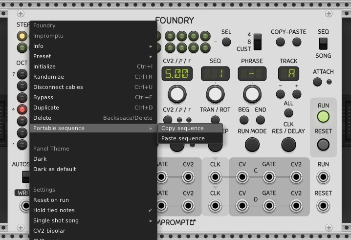

Limitations: As a general rule, the Impromptu sequencers are not as expressive as timeline-based sequencers, so it can be anticipated that some features of the sequence will be pruned or quantized. In other words, the finest supported resolution is the quarter note (i.e. a step) and any content with finer musical resolution will be temporally quantized to quarter notes. The advanced gate types are not use to create eighth notes, for example, since no assumption regarding clock resolution can be made when pasting into the receiving sequencer. Tied steps are automatically set during a paste operation to produce half notes or anything longer that quarter notes. Rack's log file can be used to identify major problems with pasting operations. Polyphony is not supported, and the copy/paste operations are only available when the sequencers are in SEQ mode (as opposed to SONG mode).


<a id="module-manuals"></a>
# Module manuals

The following sections contain more information on how each module works.


<a id="adaptive-quantizer"></a>
## AdaptiveQuantizer


(*Concept and design by Sam Burford*)

The Impromptu Adaptive Quantizer quantizes incoming monophonic target pitch cv events according to a statistical analysis of another separate series of reference pitch events that can either be pre-recorded inside the devices pitch event memory or can be referenced to a simultaneously unfolding performance of a monophonic series of pitch events taking place in parallel.

The Adaptive Quantizer has two sets of cv/gate inputs. One is used to record the reference performance, with a second pair providing the pitch material to be quantised. Two quantized pitch cv outputs are provided, one monophonic, the other polyphonic (CHORD). The gate output simply mirrors the gate signal appearing at the input gate. The Adaptive Quantizer only supports monophonic pitch inputs.

Unlike pitch quantizers that quantize pitches according to a predetermined scale such as C Minor, the Adaptive Quantizer uses statistical weighting to determine the most popular/frequent pitches appearing at a reference input, and uses these calculations to determine how a second parallel series of incoming pitch events are quantised. It does not analyse the incoming pitches according to established music theory but instead uses statistical prevalence. This means that sometimes the resulting quantization may not be within a recognised scale. The advantage is that if the incoming reference changes key or tonality, then the Adaptive Quantizer may be better able to reflect these changes. This is also important in scenarios where the key of the reference is unknown or is uncertain and shifting. Statistical prevalence however does not necessarily reflect the underlying tonality of an incoming reference, so there will be times where the Adaptive Quantizer seems off key. Accordingly, the device has a number of controls to help work towards the desired results but there are no guarantees they will influence the output in the way that users desire. As with many musical instruments, if it sounds right then it’s right.

The Adaptive Quantizer works by listening to a series of reference pitch events which are then captured inside the Adaptive Quantizer’s internal Data Table. The Data Table holds 240 monophonic pitch events that are internally quantised to the 12-TET note format. Once the Data Table fills up with these reference pitch events, it continues to update as it receives new reference pitch event information, continually over-writing its internal memory as it goes, much like a live looper. This continuous updating can be held (stopped) or allowed to continue by toggling the FREEZE button.

Each incoming pitch cv/gate event fed into the reference input is stored as a series of linked data values: pitch value (stored in a range from 1 - 12), octave value, duration value and pitch interval value.

A number of controls are available to determine how the pitch event information stored in the Data Table is used to statistically influence the quantisation of the incoming pitch cv data, ranging from the maximum number of output pitches (PITCHES), to the OCTAVE and DURATION parameters which can be used to bias the selection of output pitch values. Additional windowing controls (PERSIST and OFFSET) allow users to select which region of the Data Table is used to determine the current quantization weighting.

The Adaptive Quantizer can be used in a number of ways. One possible use is to adaptively quantize a live keyboard performance according to the dynamic musical context played by another performer. The device can also be used in any number of generative roles. Users are encouraged to experiment and share their findings.

The Adaptive Quantizer’s control panel has two display areas: Target Pitch Display and a combined Data Table/Pitch Matrix Display.

Target Pitch Display. Located across the top of the device panel, this row of 12 LEDs indicates which pitch values are currently available for output by the device.

Data Table/Pitch Matrix Display. This large, dual purpose display depicts a 5x12 LED array. Each LED represents 4 stored pitch events. In Data Table mode (momentarily visible when either the PITCHES or OFFSET controls are touched) it is possible to see the number of stored pitch events and the scope of the window used to determine which pitch events (in green) currently influence the quantization calculations. In Pitch Matrix Display Mode, which is the devices’ general mode of operation, each coloured LED column indicates the current weighting for each separate pitch (C through B). Flickering horizontal lines of bright LED’s reflect how the device quantizes the input pitches.

The Adaptive Quantizer has a number of controls that can either be manually adjusted or dynamically modulated by feeding cv signals into the associated input jacks. These can produce interesting evolving results.

* **PITCHES**: Determines the number of target pitches to which incoming pitch events will be quantized to (1 to 12). When set to one, only a single pitch value will be output by the device. When set to 12 the device effectively operates as a chromatic quantizer. Setting the number of pitches to around four or five is a good starting point.

* **PERSIST**: Determines the number of reference pitch events stored in the Data Table that are actively used to determine the weighting of each target pitch. A very low setting makes the Adaptive Quantizer closely follow the reference, while a very large setting will effectively smooth out any variations that appear in the reference. Setting the PERSIST to low values of around 16 or 32 is a good place to start.

* **OFFSET**: Determines the start position of the active region or window being used to determine the target pitches. If the Data Table is considered as a form of pitch memory, by altering the OFFSET control to a non zero value, prior pitch events can be used to determine how the quantisation influences the quantization of current output pitches. So for instance if the reference input captures a change of key, and the OFFSET is set to 64 pitch events, then the Adaptive Quantizer will effectively lag and reflect the previously recorded key change 64 gate events later. This lag can be used to introduce tension and anticipation into a composition. A good initial starting point is a very low or zero value for the OFFSET. The small red LED near the OFFSET control indicates when an empty region in the Data Table is active. In this scenario the pitch cv output of the Adaptive Quantizer is halted until the empty active region is filled with reference pitch event information or the OFFSET is adjusted to reference a window in the Data Table that is filled with reference pitch event information. This is one of the main reasons that a good initial OFFSET starting point is a very low or zero value.

* **OCTAVE**: Biases the weighting of active pitches that will favour high pitches (when OCTAVE is turned clockwise) or low pitches (when OCTAVE is turned counter-clockwise). In its full clockwise position, pitches in octaves 7 or more will be given a x5 weighting (overweighted) compared to pitches in the central octave (octave 4). Pitches in octave 1 or lower will be given a /5 weighting (underweighted). When the knob is fully counter-clockwise, these weightings are inverted. In its centre position, the OCTAVE knob does not apply any bias to the reference pitch weightings.

* **DURATION**: Biases the weighting of active pitches that will favour those pitches associated with long gate events (when DURATION is turned clockwise) or shorter gate events (when DURATION is turned counter-clockwise). A simplified explanation of how this control works is as follows: In its full clockwise position, gate events of the maximum duration within the active window are given a x5 weighting, while gate events that match the calculated average duration are not weighted (i.e. x1 weighting), while shorter gate events are given a /5 weighting. When the knob is fully counter-clockwise, those weightings are inverted. In its centre position, the DURATION knob does not apply any bias to the reference pitch weightings.

* **CHORD**: Number of voices (N) in the polyphonic chord output (1 to 5). When set above 1 the device output produces a polyphonic cv signal with the N-most highest weighted notes.

* **THRU**: Thru quantization to 12 tone equal temperament. The statistical component of the pitch quantisation is paused and the device acts as a chromatic scale quantizer.

* **S&H switch**: Sample and hold output pitch values controlled by the gate input. This option can be useful to prevent the quantizer’s output pitches from unexpectedly jumping when the reference context changes ( for instance by modulating the OFFSET value). The trigger for the sample and hold is linked to the live gate input (not the reference gate input). The sample and hold also applies to the chord output.

* **INTERVAL switch**: This switch has three settings: LAST (yellow), MOST (green) and OFF. In LAST mode, the device's normal mode of quantization (which uses a mixture of proximity and statistical pitch prevalence) is altered to also take into account the most recent active pitch interval value appearing at the device's target pitch input to influence how output pitch events are quantized. In MOST mode, the quantizer will instead use the most frequent pitch interval values stored in the active Data Table region to influence the device's quantization. A pitch interval is defined in this context as the numerical pitch difference between a given reference pitch/gate event and the one preceding it. The impact of this control is highly source material dependent - try it and see what it does in your patch.

* **FREEZE**: Suspends the capture of any new reference pitch events in the Data Table. When frozen, the Adaptive Quantizer will still function as normal but will ignore any incoming reference pitch events. As an example use case, when frozen the Adaptive Quantizer can be used to quantize according to a fixed set of previously stored pitch events. It is worth noting that all of the pitch event information stored in the devices Data Table is stored inside the Adaptive Quantizer’s VCV saved preset file and therefore can be reloaded at a later stage. If the Freeze button is active as the preset is loaded then the original pitch event information stored in the Data Table will be retained. If subsequently the Freeze button is released and new pitch events appear at the reference input, then incremental sections of the Data Table will be overwritten as the device updates.

* **RESET**: Clears all of the pitch event information stored in the Data Table and turns off FREEZE. The module's pop-up menu can be used to select different reset behaviour: None (just clear freeze), Clear all (default, as described above), Clear with priming (similar to Clear all but seamlessly inserts the four most recently captured reference pitch events at the start of the empty Data Table). The last option can be used when a reset is required and continuous quantization is needed during the reset event.

The module's pop-up menu can also be used to set the device to disregard any successive repetitions of identical reference pitches fed into the Adaptive Quantizer. For example, if the following sequence of reference pitches is presented: C4, C4, D5, C5, E5, E5, E5, the Data Table will only capture four pitch events (C, D, C, E) along with their associated octave, duration and pitch interval values.

A small warning LED set to the right of the modules title, reflects when quantization is taking place normally (OFF) or when the active Data Table region is empty (ON) or when the quantizer is operating chromatically (i.e all 12 notes are being used for quantization) - ON.


([Back to module list](#modules))


<a id="big-button-seq"></a>
## BigButtonSeq

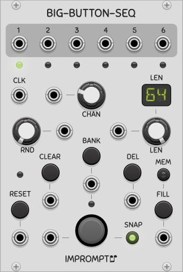

A 6-channel 64-step trigger sequencer based on the infamous [BigButton](https://www.youtube.com/watch?v=6ArDGcUqiWM) by [Look Mum No Computer](https://www.lookmumnocomputer.com/projects/#/big-button/). Although this is not a direct port of the original module, the intent was to keep it as faithful as possible, while adding a few minor extras such as CV inputs and displays. For two-handed control of the knobs and buttons, connect the sequencer to a midi control surface using Rack's Core MIDI-CC module. To see more examples of what the sequencer can do, please see the following videos:

* [BigButton VCV Rack Module test](https://www.youtube.com/watch?v=uN2l2t5SCyE) by Alberto Zamora;

* [Small impromptu VCV jam](https://www.youtube.com/watch?v=wm5JEH5spbc) by Matt Tyas;

* [lookmom](https://www.youtube.com/watch?v=Jcdok8jJ5hQ) and [bbs](https://www.youtube.com/watch?v=j5ejGH5XgFg) by Clément Foulc.

Here are a few more details on some of the uses of the buttons. The sequencer uses has two types of push-buttons, namely trigger buttons and state buttons. Trigger buttons react to the change in a button's state as it's being pressed, while state buttons react to the position of the push-button, i.e. pressed or not pressed.

* **CHAN**: channel select button (can be changed in real time). All state buttons will have an effect immediately when the channel is changed.

* **BIG BUTTON**: trigger-type button to set the trigger at the current step in the current channel and bank. When pressing on a step that has a trigger, nothing is done.

* **CLK**: clock input. The sequencer is always running. To stop it, the clock has to be stopped.

* **RND**: a 0 to 1 probability knob, used to randomly change the state of a step. The probability is applied to the trigger of the next step being reached at every clock pulse, in the current channel. A 0 value means no change, 1 means the state of the trigger will be toggled (useful for inverting a pattern). The RND CV input's voltage is divided by 10 and added to the value of the knob to yield the actual probability. For example, with the knob at full right, the CV input has no effect, and with the knob at full left, a value of 10V on the CV input gives a probability of 1.  

* **CLEAR**: state-type button that turns of all triggers of the current channel.

* **BANK**: trigger-type button that toggles between two possible banks (i.e. sequences) for the current channel.

* **DEL**: state-type button that clears the trigger at the current step. The button can be held to clear multiple steps.

* **FILL**: state-type button that plays continuous triggers for the given channel as long as the button is kept pressed. The fill starts on the next clock edge and continues on each clock edge while the button is held. 

* **MEM**: when the MEM button is turned off, the fills are not written to memory and are only for playback. 

* **SNAP**: the BIG and DEL buttons are quantized to the nearest beat when the SNAP button is active. Without quantization, button presses always affect the current beat (step) of the sequencer. With quantized buttons, they affect the nearest beat. For example, without quantization, pressing the big button 1 microsecond before a beat would normally record the beat in the current step and not the next one that is about to occur (which is actually the closest). For the quantization to work properly however, the sequencer must receive a stable clock of at least 30 BPM. When this is not the case, the option is automatically disabled internally. When manually advancing the clock to program a sequence in non real-time, for example, the option has no effect and the current step is always the target of a button press.

* **Big and Del on next step**: this option is available in the right-click menu of the module. When active, all hits of the big and del buttons are registered on the step that follows the current step. Snap has no effect when this option is activated.

Here is a summary of how **SNAP** and the **Big and Del on next step** option work.
* Big button hit (or del) with **snap off** and the next step **option off**:
	* play the trigger exactly when the button is hit
	* record the trigger in the beat that last happened (i.e. the current step)
* Big button hit (or del) with **snap on** and the next step **option off**:
	* if the nearest beat is the one that should come next (given current BPM), play and record the trigger in the next beat to come
	* if the nearest beat is the last one that happened, do the same as when SNAP is off
* Big button hit (or del) with the next step **option on** (snap has no effect): 
	* play and record the trigger in the step that follows the current step (loops around according to selected length)

([Back to module list](#modules))


<a id="big-button-seq2"></a>
## BigButtonSeq2

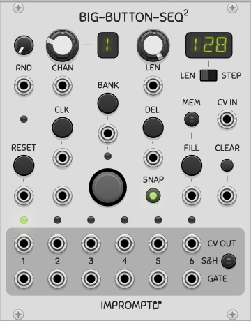

A 6-channel 128-step gate and CV sequencer based on [BigButtonSeq](#big-button-seq). Familiarity with that sequencer is recommended since only the differences are discussed here. With its long sequence lengths and CV capabilities, the sequencer can be used as a CV recorder by setting the FILL CV input to a constant voltage greater than 1V and activating the MEM button, thereby sampling the CV IN port at every clock edge and committing its voltage to memory.

* **BIG BUTTON**: as well as turning on the gate of the current step, the CV IN port is also read and stored as the CV value of the given step.

* **GATE**: the clock signal's pulse is used as the gate out pulse, contrary to BigButtonSeq that emits 1 millisecond triggers.

* **CLEAR**: trigger-type button that turns of all gates and reinitialized all CVs to C4 for the current channel, contrary to BigButtonSeq where CLEAR is a state-type button.

* **S&H**: sample and hold the CV outputs using the gate outputs as the triggers for the sampling.

This sequencer has no concept of tied notes; when pasting sequences using the [Portable sequence](#portable_seq) format, notes that are longer than one step will have successive gate pulses on each step comprising the note.

([Back to module list](#modules))


<a id="chord-key"></a>
## ChordKey

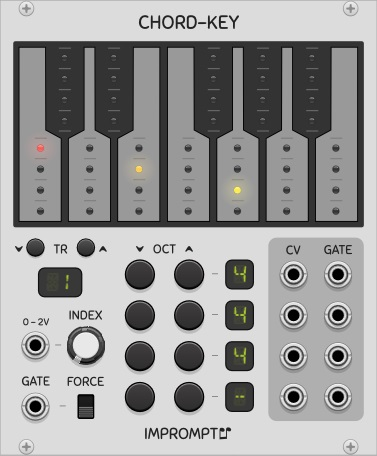

A keyboard-based chord generator with room to store 25 chords, that can be recalled using a 0 to 2V control voltage. Up to four notes can be set for each chord using the keyboard and the octave buttons. The [FourView](#four-view) module can also be used as an expander for the ChordKey to view the note names of the notes comprising the chord or the name of the chord itself; in this case no cables need to be connected to FourView it is immediately to the right of ChordKey.

An [expander](#expanders) is also available (titled CHD-X), which offers four polyphonic quantizers that can be used to quantize any pitch CVs to the notes of the active chord selected in ChordKey. When the ChordKey expander is used independently, it will quantize pitch CVs according to all twelve notes.

* **INDEX**: This knob is used to select the given chord from the set of 25 possible chords that can be stored in the module. 

* **0 - 2V**: The CV input labeled "0-2V" is a CV value that is added to the value of the Index knob, and can be used to control the selected chord. When using the 0-2V input, the knob should ideally be in its left-most position. Each chord can then be recalled using the V/Oct voltages corresponding to the interval of notes from C4 (= 0V = 1st chord) to C6 (= 2V = 25th chord). With this range, chords can be recalled using a single note output from another sequencer in order to play chord progressions. Another interesting use case is to set up the [CV-Pad](#cv-pad) module to play the chords using single buttons (see its menu option called *Fill with notes C4-D5#* for automatically setting up these voltages in the CV-Pad).

* **CV and GATE**: These outputs at the right side of the module are the different notes comprising the chord. Each row of outputs corresponds to the given note in the keyboard, from top to bottom respectively. An option is available in the module's right click menu to merge lower rows into the top row's outputs. When this is the case, the top row's CV and gate outputs become polyphonic.

* **OCT -/+**: Buttons to set the octaves of each of the notes in the chord. When a note is not used, setting its octave to "-" will remove it from the chord. For example, a C-major triad does not use the fourth note so it's octave is set to "-", thereby deactivating it. The range of possible values is "-" and 0 to 9.

* **GATE**: This input is routed to the gate outputs of all active notes when a monophonic gate signal is given. When a polyphonic gate signal is given, the gate of the Nth channel is routed to the gate output of the Nth note of the chord. In other words, when using a mono gate signal, all gates will be triggered simultaneously. When using a polyphonic gate with 4 channels, each channel will trigger the different notes separately. This can be used to arpeggiate the chord with a proper polyphonic gate signal. If the gate signal has only two channels, for example, the top gate output will fire according to channel 1's input gate, but all other outputs will use the input gate on channel 2.

* **FORCE**: When setting up the chords it can be useful to have all of the gate outputs permanently on in order to hear the chord. This switch will override the Gate input and set all gate outputs to 10V.

* **TR**: These buttons transpose the chord up or down by one semitone. The octave values are automatically adjusted accordingly. Transpositions can also be performed using the slider in the module's right-click menu.

Other options are also available in the right-click menu:

* **Copy/Paste chord (internal)**: Use this to copy a chord from one index position and paste it into another index position. This uses an internal memory and will copy/paste a chord exactly as it appears (with any unused notes in the same position). 

* **Keypress monitoring**: When this option is checked, left clicking the keys will play all the notes of the chord, i.e. the gates of the active notes will be held as long as the left mouse button is pressed. Pressing the right button of the mouse only activates the gate of the note being pressed, such that it can be heard (monitored) individually without the other notes of the chord.

The **Portable sequence** standard can also be used to copy/paste chords externally, for use in sequencers or other modules (and also within ChordKey itself). For this, use the menu item labeled "_Portable sequence_" instead of the internal copy/paste actions. The "_Copy chord_" item will copy all notes to a sequence of one step thus preserving the chord, whereas "_Copy chord as sequence_" will arpeggiate the chord into a sequence of (up to) four steps, which can be useful for copying the notes into monophonic sequencers. The "_Paste chord_" item takes only the notes that share the same time step as that of the first note given (thus a true chord), whereas the "_Paste sequence as chord_" item makes a chord out of the first four notes given, irrespective of when they occur in the sequence, which can be useful for making a chord from the notes in a series of steps in a monophonic sequencer. Here are the keyboard shortcuts for these commands:

* _Copy chord_: SHIFT + C
* _Paste chord_: SHIFT + V
* _Copy chord as sequence_: SHIFT + ALT + C
* _Paste sequence as chord_: SHIFT + ALT + V

([Back to module list](#modules))


<a id="clocked"></a>
## Clocked/Clkd

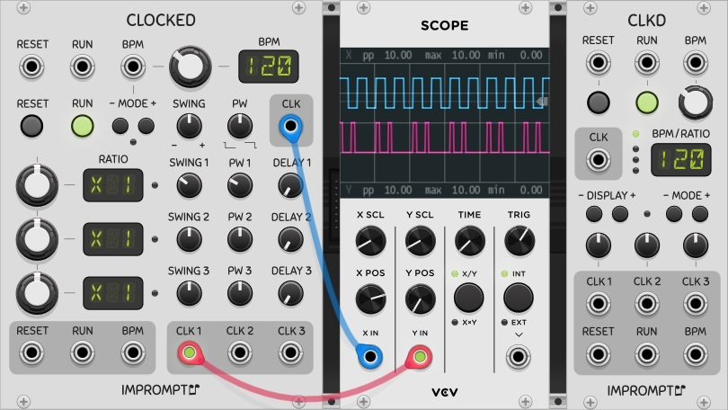

Clocked: A chainable master clock module with swing, clock delay and pulse width controls, with master BPM from 30 to 300 and all mult/div ratios up to 16, including 1.5 and 2.5, and with additional ratios spanning prime numbers, powers of two and common PPQN values up to 96. The clock can produce waveforms with adjustable pulse widths for use with envelope generators or sequencers that use the clock pulse to produce their gate signals. The clock can also be synchronized to an external clock source.

Clkd: A smaller version of Clocked but without swing, clock delay and pulse width.

It is strongly recommended to read the section [general concepts](#general-concepts) for more relevant information that is not repeated here. 

* **RESET**: Restart all channels' time keeping. The clock outputs are held high when a stopped clock is reset (instead of low). This is required so that when controlling sequential switches (which are assumed to also be reset on the same event) will not get triggered and moved to step 2 when the clock is started again. The right-click menu option "*Outputs high on reset when not running*" can be turned off, to allow the outputs to be held low when resetting a stopped clock.

* **RUN**: The run button functions as a pause/play button. When turned off, the clock outputs are held in their current states. When run is turned on again, the clock engine resumes where it left off, such that when using multiple outputs with different clock ratios, a large patch with multiple sequencers playing at different speeds will not be out of sync. This effectively makes for proper pausing behavior in multi-track and multi-clock patches. For sequencers with RUN inputs, it may be beneficial to connect the RUN output of Clocked/Clkd to the RUN input of the sequencers. In the case of the Phrase Sequencers (see below), this will ensure gates are not kept high while stopped, and will also allow feedback of the notes that are entered when programming a stopped sequencer. For more detailed explanations on this, please see this section on [resets, clocks and run states](#clk_rst_run).

* **SWING**: The clock swing is loosely based on the [Roger Linn method](https://www.attackmagazine.com/technique/passing-notes/daw-drum-machine-swing/). For a given clock, all even clocks pulses are offset forward/backward according to the setting of the Swing knob; at 0 (top) everything is aligned as normal. At -100, all even clocks would coincide with odd clocks preceding them, and at +100 they would line up with subsequent clock pulses). The knob thus goes from -99 to +99 such that no beats are missed. In its extreme positions, the timing is tighter than 99 percent of a clock period (the 99 value is only a rough indication). 

* **PW**: Pulse width is dependent on the swing knob, but can be used to control the general duration of the clock pulse. In the worst-case knob settings, the pulse width is guaranteed to be a minimum of 1ms, with a minimum 1ms pause between pulses. 

* **DELAY**: Clock delay can be used to offset a sub-clock relative to the master clock, and is expressed in fractions of the clock period of the given sub-clock. Using the right-click menu, the delay value can also be displayed in notes, where one quarter note corresponds to a clock period. It is important to keep in mind, however, that the ratio knobs in Clocked are not PPQN settings as such, they are general clock frequency selectors. For example, setting a ratio to x24 with a master tempo at 120 BPM, the clock delay will be applied on a very fast clock, which is practically imperceptible: in this example, a clock delay of 1/16 note is actually equal to a quarter of a clock interval at 2880 BPM! (2880 = 120 x 24) 

In place of a detailed explanation of these three main controls (Swing, PW and Delay), it is recommended to connect the outputs to a scope or a logic analyzer, such as the VCV Scope (pictured above) or the SubmarineFree LA-108, to observe the effects of the different controls. 

PW and Swing CV inputs are aso available in the Clocked [expander module](#expanders) (available for Clocked only). These inputs have a range of -5V to 5V when the corresponding knobs are be in their default position. With the corresponding knobs turned full left, the usable range on the inputs becomes 0V to 10V, with no-swing and normal-pulse-width correspond to 5V on the CV inputs.

Many options are available in the modules' **right-click menu**, and can be used to setup Clocked/Clkd for your particular needs. In particular, the RUN CV input is trigger sensitive by default, but can be made level sensitive (gate mode) by turning on the "_Run CV input is level sensitive_" option; when chaining multiple Clocked/Clkd modules, only the first module in the chain should have this option turned on. 

Clocked and Clkd also feature the ability to automatically patch the Reset, Run and BPM cables to a designated clock master. Any instance of Clocked or Clkd can be designated as the clock master using the module's "_Auto-patch_" menu entry. When auto-patching clocks: if the slave clock already has a connection to one of the inputs mentioned above, that input un-touched; the status of the "*Outputs high on reset when not running*" setting will be copied from the master clock into the slave clock.


<a id="clocked-sync"></a>
### External synchronization

By default, the clock's BPM input is level sensitive and follows [Rack standards for BPM CVs](https://vcvrack.com/manual/VoltageStandards.html#pitch-and-frequencies). Synchronizing Clocked to an external clock signal can be done by selecting a mode other than "CV" with the MODE buttons located below the BPM input jack. The possible synchronization settings are: P2, P4, P8, P12, P16, P24, where the number indicates the number of pulses per step of the external clock source.

When using a chain of Clocked modules, all modules must have the same mode setting. The LED next to the mode buttons will light up when the sync mode is enabled; however, when no cable is connected to the BPM input jack, a regular clock is produced according to the BPM knob's value.

When using external clock synchronization, Clocked syncs itself to the incoming clock pulse, and will stay synchronized, as opposed to just calculating the BPM from the external source. This means that it will not drift (or that it will drift in time with the incoming pulses if they drift), and it should stay perfectly synchronized over time; it also allows for latency compensation. Here are a few points to keep in mind when using clock synchronization.

1. Clocked can not be manually turned on in clock sync mode, it will autostart on the first pulse it receives.
1. Clocked will automatically stop when the pulses stop, but in order to detect this, it take a small amount of time. To stop the clock quickly, you can simply send a pulse to the RUN CV input, and if the clock is running, it will turn off.
1. The external clock must be capable of sending clocks at a minimum of 2 pulses per quarter note (PPQN) and should not have any swing.
1. Clocked does not perform any interval averaging and tries to sync to the incomming pulses as rapidly as possible. This may sometimes cause the BPM setting to fluctuate widely before reaching a perfect lock.
1. Clocked can support and synchronize to fractional BPM values (ex.: 133.33 BPM), but will show the BPM rounded to the nearest integer in the BPM display.
1. For low clock BPMs, synchronization may take some time if the external clock changes markedly from the last BPM it was synchronized to. Making gradual tempo changes is always recommended, and increasing the PPQN setting may also help. An other method consists in priming Clocked with is correct BPM first, to let it learn the new BPM, so that all further runs at that BPM will sync perfectly.
1. When sending a clock from a DAW or other source external to Clocked in Rack, best results are obtained when sending this clock through an audio channel as opposed to midi clocks.

([Back to module list](#modules))


<a id="cv-pad"></a>
## CVPad

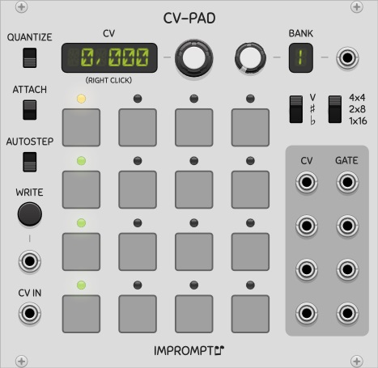

A programmable CV controller with 16 pads, that can be configured into 1x16, 2x8 or 4x4 group(s). Many use cases are possible, one of which can be to manually select sequences to play in Foundry and many of the Phrase Sequencers, and more generally to control parameters for a live performance by providing quick access to different CV values. 

The [FourView](#four-view) module can also be used as an expander for the CVPad to view the note names of the selected pads; in this case no cables need to be connected to FourView provided it is placed immediately to the right of CVPad.

* **CV**: The main CV display and its knob can be used to set the CV for the currently selected pad, as indicated by the yellow/red light above a pad when attached/detached respectively. By default this knob is set to high sensitivity such that the range from -10V to 10V can be easier to scan; however, an option is available in the module's right-click menu to lower the sensitivity. Values can also be entered directly for the selected pad by **right-clicking the display** and typing in a specific voltage. 

* **QUANTIZE**: When activated, this option quantizes only the main CV display and the CV outputs, it does not affect the actual CVs stored in the module.

* **ATTACH**: When attached is activated (default), clicking on a pad to edit its CV will also move the read head(s) to that location. If a pad is to be edited without affecting the currently selected pad, turning attach off will move the editing head only.

* **AUTOSTEP**: When activated, a write operation will automatically move to the next pad after writing the CV, such that the entire array can be filled with CVs from an external source ([TwelveKey](#twelve-key) for example).

* **WRITE**: Writes the CV present on the CV IN jack into the currently selected pad. The unlabeled jack below this button can be used to send a trigger to automate the writing. By connecting the CV output of TwelveKey to the CV IN input of CVPad, the GATE output of TwelveKey into the WRITE input in CVPad, and with AUTOSTEP on, a series of notes can be entered directly into each of the 16 pads.

* **V, sharp, flat**: This three-position switch is used to select the display mode of the main CV display.

* **4x4, 2x8, 1x16**: This is the main configuration switch of the module, and allows the grid of pads to be used as one group of 16 pads (top outputs only), or two groups of 8 pads (top and third row outputs only), or four groups of 4 pads (all rows of outputs).

* **BANK**: This is used to select one of 8 sets of pad values stored in memory, and can itseld be CV controlled.

The module also features sliders and menu items to copy and paste the CVs, and also to offset/multiply/divide the stored CVs.

([Back to module list](#modules))


<a id="foundry"></a>
## Foundry

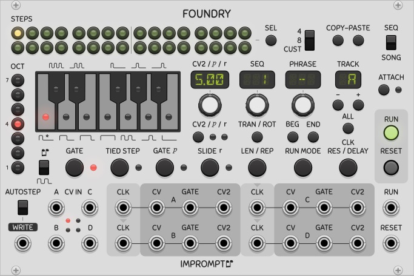

A 4-track phrase sequencer with 32 steps per sequence, 64 sequences per track, 99 phrases per song. A phrase is a sequence number and a repetition count. Each track holds one song and can be independently clocked and edited. The SEL and ALL buttons allow the selection and simultaneous editing across multiple steps and tracks respectively. 

CVs can be entered into the sequencer via CV inputs when using an external keyboard controller or via the built-in controls on the module itself. When notes are entered on the built-in keyboard using right-clicks of the mouse, the sequencer automatically moves to the next step. Holding ctrl while right-clicking also copies the current note/gate-type over when moving to the next step. Double-click defaults are supported on the three main knobs.

The following block diagram shows how the different sequencer elements are hierarchically related.
 


Here are some further details on the different functions of the sequencer. It is also strongly recommended to read the section [general concepts](#general-concepts) for more relevant information that is not repeated here.

* **CLK**: The clock inputs for each track. When the input is unconnected in a track, the track automatically uses the clock source of the preceding track (indicated by arrows above each clock input). It is good practice that the clock for track A be connected as directly as possible to the main clock source, and when a chained series of clock modules are used, the clock input of track A should be connected to a clock output from the *first* clock module of the chain.

* **SEQ / SONG**: This is the main switch that controls the two major modes of the sequencer. Seq mode allows the currently selected sequence in each track to be played/edited. In this mode, all controls are available (run mode, transpose, rotate, copy-paste, gates, slide, octave, notes) and the content of a sequence can be modified even when the sequencer is running. Song mode allows the creation of a series of sequence numbers (called phrases). In this mode, the run mode and length of the song and the sequence index numbers themselves can be modified (whether the sequence is running or not); some of the other aforementioned controls are unavailable and the actual contents of the sequences cannot be modified.

* **CV2/p/r display**: Depending on the state of the display, the display and its associated knob are used to set either the voltage of the CV2 output, the probablility of a step playing when its probability is turned on, or the rate of the slide for the given step when its slide it turned on.

* **SEQ display**: Selects the sequence to play/edit in Sequence mode, or selects the sequence number associated with the current phrase in Song mode. Sequence numbers can also be typed in using the computer keyboard when the mouse cursor is placed over this display; when in song mode, the space bar can be used to automatically move to the next phrase in the song. Two key presses within the span of one second will register as a two digit sequence number.

* **PHRASE display**: Used to select which phrase to edit, available in Song mode only.

* **ATTACH**: Allows the edit heads to follow the run heads of all tracks (Attach on). For the current track, the position of the edit head is shown with a red LED, and when running, the position of the run head is shown with a green LED. When in Seq mode, the actual content of the step corresponding to the edit head position (i.e. note, oct, gates, slide) can be modified in real time, whether the sequencer is running or not. The edit heads automatically follow the run heads when Attach is on.

* **BEG / END**: The BEG and END buttons set the endpoints of the song, such that when working on a long song, we can more easily work on a section of it, which is more practical.

* **LEN / REP**: Sequence lengths can be set by clicking the button when in SEQ mode, and then either turning the main knob below the main display or clicking the desired length directly in the steps (the second method is the recommended way since the display will automatically return to its default state afterwards). The sequences can have different lengths. When in Song mode, the same button instead serves to set the number of repetitions of the current phrase; this allows the repetition of a sequence up to 99 times, for any run mode selected. To skip the given phrase when the song plays, set the number of repetitions to 0.

* **RUN MODE**: Used to set the run mode of the selected sequence when in SEQ mode, or of the song (selected track) when in SONG mode. The modes are: FWD (forward), REV (reverse), PPG (ping-pong, also called forward-reverse), PEN (pendulum, like PPG but the first and last steps are not played twice), BRN (Brownian random), RND (random), TKA (use the step/phrase run positions of track A). The TKA mode can be used to ensure chord notes are randomized together across tracks. For track A, the TKA mode is equivalent to FWD.

* **CV2**: These secondary CV outputs can be used for accents, velocities or any other auxiliary control voltage. CV2 is a 0V to 10V control voltage by defaut, but by checking the Bipolar option in the right-click menu, they can be -5V to 5V outputs. Three modes are available in the right-click menu:
    * Volts: direct control of the CV2 output voltages, with 0.05V resolution;
    * 0-127: midi-like numbered levels, mapped to 0V to 10V or -5V to 5V on the CV2 outputs;
    * Notes: same as 0-127 but rescales the CV2 outputs to semitones.
	
* **CV IN and CV2 IN**: These inputs can be used for programming the sequencer from external sources. The CV2 IN inputs are located in the Foundry [expander module](#expanders). When a trigger is sent to the WRITE input, the states of the inputs is written into the sequencer at the current step/sequence. Unconnected inputs are ignored. When planning a project, all sequences that are to hold chords must have the same sequence numbers across all tracks. AUTOSTEP automatically moves to the next step in the sequence when a write occurs. The TRACK CV input has been extended to allow ALL tracks to be selected, and unless all tracks are selected, writing via CV inputs is now only done in the currently selected track. A button located in the expander module allows the writing of CV IN only, CV2 IN only, or both.

* **CLK RES / DELAY**: Settings for clock resolution and clock delay. The clock resolution allows [advanced gate types](#advanced-gate-mode-ps) to be used, and functions similarly to that found in the PhraseSequencers. In Foundry however, when using only one clock source, clock resolution also effectively functions as a clock divider, provided the gate types required are compatible with the multiple chosen; clock resolution can thus be used to slow down the clocks of certain tracks compared to others. Clock delay is used to delay the clock of a track by a given number of clock pulses (0 to 99). When clock resolutions above 1 are used, the clock can be delayed by fractions of a step. For example, with a clock resolution of 4 and a clock delay of 1, a track will be delayed by one quarter of a step. A reset must be performed in order for a new clock delay value to take effect. Clock delay should not be used in conjuction with the TKA run modes in sequences and songs.

* **SEL and ALL**:  The SEL and ALL buttons allow the selection and simultaneous editing across multiple steps and tracks respectively; however, since there is currently no undo feature in the sequencer; patches should be saved often. The number of steps selected by SEL is specified using the 4/8/CUST switch. Selecting an arbitrary range of steps for editing can be done using the custom (CUST) setting, and functions similarly to custom step selection in copy-paste (described next).

* **COPY-PASTE**: Copies part or all of a sequence to the sequence buffer when the main switch is set to SEQ, or copies part or all of a song to the song buffer when the main switch is set to SONG. In order to copy paste all steps/phrases, the cursor must be in the first step/phrase. Since there is only one sequence buffer, there is currently no way to copy sequence #1 of all tracks to sequence #2 of their respective tracks, for example, in a single operation. This must be repeated manually in each track. The number of steps/phrases that are to be copied is determined by the 4/8/CUST switch. 
	* 4/8: automatically copies 4/8 steps (in SEQ mode) or 4/8 phrases (in SONG mode) starting in the current edit position. 
	* CUST: copies a user-selectable (custom) number of steps/phrases. The CUST setting, when properly used, allows insert and delete to be performed more efficiently. Using the CUST setting with SEL allows an arbitrary range of steps to be selected: when SEL is turned on, clicking steps to the right of the current position will reduce the length of the selection to the number of steps desired; when SEL is not used, CUST automatically selects all steps from the edit head (cursor) to the end. In SONG mode, copying a custom range of phrases is also a two step process: first move to the start phrase, then press COPY once, and then move to the end phrase and press COPY once more to copy that range of phrases.

* **SEQ# input**: These CV inputs are located in the Foundry [expander module](#expanders). In addition to allowing the selection of the sequence in each track, the SYNC SQ# switch, when activated, can be used to defer any selection change until the end of the sequence is reached.

* **TRACK input**: This CV input is located in the Foundry [expander module](#expanders), and allows the selection of the track number. A 0-10V CV is linearly mapped to the following track selections: A, B, C, D, A\*, B\*, C\*, D\*, where the star denotes that any change will be done across all tracks. This applies to the CV and CV2 inputs as well (see "CV IN and CV2 IN" above).

* **STEP<, STEP>**: These CV inputs are located in the Foundry [expander module](#expanders). A trigger in these CV inputs will step the current sequence one step left or right in SEQ mode, and will step the phase up or down in SONG mode.

* **TIED**: Please see [PhraseSeq16](#phrase-seq-16)'s section on [tied steps](#tied-ps).

* **GATEP**: Activates the use of probability in the current step's gate. The probability controls the chance that when the gate is active it is actually sent to its output jack. The probability for the step can be set using the CV2/p/r section (press the button below CV2 until the yellow LED below the "p" lights up). The probability ranges from 0 to 1, where 0 is no chance to fire and 1 is 100% chance to fire (the default is 0.5 for 50% chance). 

* **SLIDE**: Portamento between CVs of successive steps. Slide can be activated for a given step using the slide button. The slide duration of the step can be set using the CV2/p/r section (press the button below CV2 until the red LED below the "r" lights up). The slide ratio can range from 0 to 1, where 1 is the duration of a clock period (the default is 0.1). 

* **TRAN/ROT**: Transpose all 32 steps, or rotate steps 1 to LENGTH. These numbers are stored in the sequencer for each sequence. Resetting the values of a given sequence can be done by copy-pasting an unused sequence (sequence 64 typically, for example) over into the current sequence. If all 64 sequences were used, simply press paste after closing and restarting Rack as an uninitialized sequence is automatically held in the sequence copy-paste buffer upon power-up.

By default the sequencer always restarts the song (when in song mode); however, this may not always be wanted. To play the song just once, activate the option **Single shot song** in the right-click menu of the module. Since Foundry is a multitrack sequencer and there is only one global run state, one of the four tracks has to be used as the reference to stop the sequencer. This option is only well-defined when the song's run mode is either FWD or REV.

For chords or polyphonic content, an option in the module's right-click menu can be used to poly merge other tracks into track A outputs. For example, when the **Poly merge into track A outputs** is set to _Tracks B and C_, each of the CV, GATE, CV2 outputs of track A becomes polyphonic, with the content of track A in the channel 1, the content of track B in channel 2 and track C in channel 3. When a track is poly merged into track A, its output ports are set to a constant 0V. This is perfect for creating chords for polyphonic oscillators/ADSRs etc.

([Back to module list](#modules))


<a id="gate-seq-64"></a>
## GateSeq64

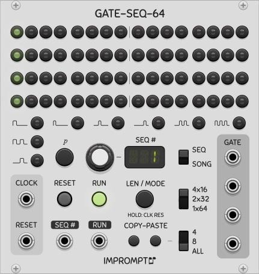

A 64 step gate sequencer with the ability to define **probabilities** for each step. A configuration switch allows the sequencer to output quad 16 step sequences, dual 32 step sequences or single 64 step sequences. It is strongly recommended to read the section [general concepts](#general-concepts) for more relevant information that is not repeated here. 

When running in the 4x16 configuration, each of the four rows is sent to the four **GATE** output jacks (jacks 1 to 4, with jack 1 being the top-most jack). In the 2x32 configuration, jacks 1 and 3 are used, and in the 1x64 configuration, only jack 1 is used (top-most jack). When activating a given step by clicking it once, it will turn green showing that the step is on. Clicking the _"p"_ button turns it yellow, and the main display shows the probability associated with this step. While the probability remains shown, the probability can be adjusted with the main knob, in 0.02 increments, between 0 and 1. When a yellow step is selected, clicking the _"p"_ button again will turn it off.

This sequencer also features the song mode found in [PhraseSeq16](#phrase-seq-16); 64 phrases can be defined, where a phrase is an index into a set of 32 sequences. In GateSeq64, the song steps are shown using the entire grid of steps, overlapped with the actual sequence progression in lighter shades in the lights. The actual content of the sequences is shown in white in Song mode. Here are a few more points regarding Song mode:

1. When not running, the phrase cursor position is shown with a red light. 
1. When running, the current phrase being played is shown with a full green light and the position in the sequence is shown with a pale green light.
1. When running, clicking a phrase turns it red (the currently playing one in green is still visible), and the knob can be used to change the sequence mapped to that phrase for live song editing. After 4 seconds of inactivity, the editing disappears.

Copy-pasting ALL also copies the run mode and length of a given sequence, along with gate states and probabilities, whereas only gates and probabilities are copied when 4 or ROW are selected. More advanced copy-paste shortcuts are also available when clicking copy in Seq mode and then paste in Song mode (and vice versa); see [cross paste](#cross-paste-gs) below. The **SEQ** CV input, sequence length selection and run **MODES** are all identical to those found in PhraseSeq16.

Although no **Write** capabilities appear in the main part of the module, automatically storing patterns into the sequencer can be performed using the CV inputs in the GateSeq64 [expander module](#expanders) (this is a separate module labeled \"GS-X\"). The cursor is stepped forward on each write, and can be repositioned at the first step by pressing the reset button, or at an arbitrary step by simply clicking that given step. When the cursor is not flashing, clicking any step will make it appear. The Write-gate (full circle) and Write-empty (empty circle) inputs (2nd and 3rd from the bottom) can be used to enter on-gates and off-gates in succession with separate external triggers (buttons). The bottom-most input is used to move the cursor to the left, whereas the Write input at the top can be used to move the cursor to the right when Gate In and Prob are unconnected. When either of these inputs is connected, the values are used to program the sequencer gates and probabilities. The extra CV inputs only have an effect in Seq mode.

As in the PhraseSeq sequencers, sequence numbers can also be typed in using the computer keyboard when the mouse cursor is placed over the SEQ# display; when in song mode, the space bar can be used to automatically move to the next phrase in the song. Two key presses within the span of one second will register as a two digit sequence number.

An option is also available in the right-click menu to lock the main display so that steps can not be inadvertantly changed. This setting also locks the gate types and the gate p button (gate probability).


<a id="advanced-gate-mode-gs"></a>
### Advanced gate mode

The advanced gate mode in GateSeq64 has some similarities to the one available in the PhraseSeq16/32 sequencers. Each gate type has its own LED button.

Holding the MODE button for **two seconds** allows the selection of the clock resolution, in number of pulses per step (PPS). When set to a value greater than 1, which unlocks the advanced gate mode, the sequencer will skip this many clock pulses before advancing to the next step. In such cases, a multiplied clock must be supplied in order to keep the same tempo in the sequencer. In advanced gate mode, the pulse width of the clock is not used and has no effect on the gates.

The PPS should be a multiple of 4 for the first three gate types, while the PPS should be a multiple of 6 for the last five gate types. A chosen gate type not meeting its required pulse rate will have a red LED beside it to indicate this (normally it is green). When a gate type is red, the sequencer will still emit a (possibly empty) gate pattern for that step, but with no guarantee that it will match the type that was selected. All gate types can be used when selecting a PPS value of 12 or 24.


<a id="cross-paste-gs"></a>
### Cross paste

Pressing the copy button in one mode (Seq or Song), and then the paste button in the opposite mode would normally result in an invalid operation. In these cases, depending on the state of the copy-paste switch (4/8/ALL), called *type* below, the following shortcuts are performed: 

```
Cross paste from Song to Seq  
Type   Display   Result
4      RGT       Randomizes the gate states of the current sequence
8      RPR       Randomizes the probability states and values of the current sequence
ALL    CLR       Clears (initializes) the current sequence

Cross paste from Seq to Song
Type   Display   Result
4      INC       Sets the song phrases to the sequences 1, 2, ..., 64
8      RPH       Sets the song phrases to random sequences
ALL    CLR       Clears (initializes) the song (all 1s)
```

In cross paste operation, the copied content is actually irrelevant and unused.

([Back to module list](#modules))


<a id="phrase-seq-16"></a>
## PhraseSeq16

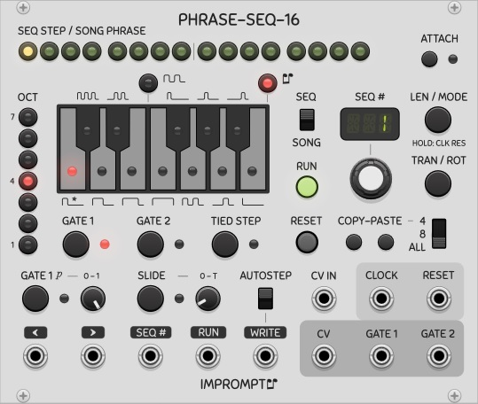

A 16 phrase sequencer module, where each phrase is an index into a set of 16 sequences of 16 steps (maximum). CVs can be entered via a CV input when using an external keyboard controller or via the built-in keyboard on the module itself. Using the song mode, a 256-step sequence can be created. With two separate gates per step, gate 2 is perfect for use as an accent if desired. When notes are entered on the built-in keyboard using right-clicks, the sequencer automatically moves to the next step. Holding ctrl while right-clicking also copies the current note/gate-type over when moving to the next step. Double-click defaults are supported on the main knob.

The following block diagram shows how sequences and phrases relate to each other to create a song. In the diagram, a 12-bar blues pattern is created by setting the song length to 12, the step lengths to 8 (not visible in the figure), and then creating 4 sequences. The 12 phrases are indexes into the 4 sequences that were created.


Familiarity with the VCV SEQ-3 sequencer is recommended, as some operating principles are similar in both sequencers. It is also strongly recommended to read the section [general concepts](#general-concepts) for more relevant information that is not repeated here.

* **SEQ / SONG**: This is the main switch that controls the two major modes of the sequencer. Seq mode allows the currently selected sequence to be played/edited. In this mode, all controls are available (run mode, transpose, rotate, copy-paste, gates, slide, octave, notes) and the content of a sequence can be modified even when the sequencer is running. Song mode allows the creation of a series of sequence numbers (called phrases). In this mode, the run mode and length of the song and the sequence index numbers themselves can be modified (whether the sequence is running or not); some of the other aforementioned controls are unavailable and the actual contents of the sequences cannot be modified.

* **SEQ STEP / SONG PHRASE**: Step/phrase selection is done by directly clicking the 16 steps at the top. When the **Reset on run** option is not active (in the right-click menu), and song mode is selected, after stopping the sequencer it will restart playing the song where it left off when it was stopped, provided no steps were clicked. When stopped, clicking a step will position the run head at that point and the song will restart at that point when turned on again. 

* **ATTACH**: Allows the edit head to follow the run head (Attach on). The position of the edit head is shown with a red LED, and when running, the position of the run head is shown with a green LED. When in Seq mode, the actual content of the step corresponding to the edit head position (i.e. note, oct, gates, slide) can be modified in real time, whether the sequencer is running or not. The edit head automatically follows the run head when Attach is on, or can manually positioned by clicking the steps when Attach is off.

* **LEN / MODE**: Sequence lengths can be set by clicking the button once, and then either turning the main knob below the main display or clicking the desired length directly in the steps (the second method is the recommended way since the display will automatically return to its default state afterwards). The sequences can have different lengths. When in Song mode, the length setting can be used to set the number of phrases in the song (the default is 4). The run modes can be set by clicking the LEN/MODE button twice starting from its initial state. Mode controls the run mode of both the sequences and the song (one setting for each sequence and one for the song). The modes are: FWD (forward), REV (reverse), PPG (ping-pong, also called forward-reverse), PEN (pendulum, like PPG but the first and last steps are not played twice), BRN (Brownian random), RND (random), FW2 (forward, play twice), FW3 (play three times) and FW4 (four times). For example, setting the run mode to FWD for sequences and to RND for the song will play the phrases that are part of a song randomly, and the probability of a given phrase playing is proportional to the number of times it appears in the song. For sequences, the FW2, FW3 and FW4 modes can be used to repeat sequences more easily without consuming additional phrases in the song. These last three modes are not available for the song's run mode however. Holding the MODE button for **two seconds** allows the selection of the clock resolution, and is the mechanism used to enable the [advanced gate mode](#advanced-gate-mode-ps).

* **SEQ#**: In Seq mode, the main display and knob determine which sequence is being edited/played. In Song mode, they determine the sequence number for the currently selected phrase in the 16 LEDs at the top of the module. Sequence numbers can also be typed in using the computer keyboard when the mouse cursor is placed over this display; when in song mode, the space bar can be used to automatically move to the next phrase in the song. Two key presses within the span of one second will register as a two digit sequence number.

* **SEQ# CV input**:  Please see [general concepts](#general-concepts) above.

* **TRAN / ROT**: Transpose/Rotate the currently selected sequence up-down/left-right by a given number of semitones/steps. The main knob is used to set the transposition/rotation amount. Only available in Seq mode. Transposition numbers are stored in the sequencer; however, rotation numbers are not.

* **COPY-PASTE**: Copy and paste sequences or parts of sequences in Seq mode, or parts of the song when in Song mode. When ALL is selected, the run mode and length are also copied for a sequence. More advanced copy-paste shortcuts are also available when clicking copy in Seq mode and then paste in Song mode (and vice versa); see [cross paste](#cross-paste-ps) below.

* **OCT and Keyboard**: When in Seq mode, the octave LED buttons and the keyboard can be used to set the notes of a sequence. The octave and keyboard LEDs are used for display purposes only in Song mode with attach on.

* **GATE 1, 2 buttons and probability knob**: The gate buttons control whether the gate of a current step is active or not. The probability knob controls the chance that when gate 1 is active it is actually sent to its output jack. In the leftmost position, no gates are output, and in the rightmost position, gates are output exactly as stored in a sequence. This knob's probability setting is not memorized for each step and applies to the sequencer as a whole.

* **SLIDE**: Portamento between CVs of successive steps. Slide can be activated for a given step using the slide button. The slide duration can be set using the slide knob. The slide duration can range from 0 to T seconds, where T is the duration of a clock period (the default is 10% of T). This knob's setting is not memorized for each step and applies to the sequencer as a whole.

* **TIED STEP**: See [tied steps](#tied-ps) below.


<a id="tied-ps"></a>
### Tied steps

When CVs are intended to be held across subsequent steps, this button can be used to tie the CV of the current step to the CV of the previous step. When tied, any changes to the CV of the head note will be propagated to all consecutive contiguous tied notes automatically. Two different *gate 1 behaviors* are available and can be toggled in the right-click menu. All gate types are adjusted automatically when tying and untying notes, and in all cases, manual inspection of the gate types will reveal what has been done in the sequencer. Any change to this option will only take effect on subsequent edits in the sequencer, such that currently entered tied notes are not automatically changed.

* When the **Held tied notes** option is activated (default behavior), then the gate 1 output is sustained (held high) across a series of contiguous tied steps, and the initial gate type of the head note will be propagated to last step's gate type.

* When the **Held tied notes** option is deactivated, only the head note has a gate and the remainder of any following contiguous gates are turned off, but can be manually turned back on if desired.
	
The following diagram shows the effect of the Held tied notes option.	
	
```
Held tied notes activated
CV:    D# D# D# D# 
Gate:  -- -- -- -_
Step:  s1 s2 s3 s4

Held tied notes deactivated
CV:    D# D# D# D# 
Gate:  -_ __ __ __
Step:  s1 s2 s3 s4
```

Extra CV inputs are also available via the PhraseSeq [expander module](#expanders) (this is a separate module labeled \"PS-X\"). Only the bottom-most input is level sensitive, the other four are trigger inputs. The expander CV inputs can only be used in Seq mode.


<a id="advanced-gate-mode-ps"></a>
### Advanced gate mode

Holding the MODE button for **two seconds** allows the selection of the clock resolution, in number of pulses per step (PPS). When set to a value greater than 1, which unlocks the advanced gate mode, the sequencer will skip this many clock pulses before advancing to the next step. In such cases, a multiplied clock must be supplied in order to keep the same tempo in the sequencer. In advanced gate mode, the pulse width of the clock is not used and has no effect on the gates.

In the advanced gate mode, the Gate1 and Gate2 lights will be a different color, and the onboard keyboard can be used not only to enter note values, but also to select one of the 12 types of gates for a given step. To enter gates, make sure the LED button located above the E and F keys is activated (pressing this button multiple times alternates between gate 1 and gate 2); to enter notes again, press the LED button above the B key. Advanced gates can only be set while in Seq mode. Here are the different gate types and their minimum PPS requirements.


All PPS settings will work for the full gate (the F key) as well as triggers (the B key). Triggers are 10ms in duration. A full gate remains high during the entire step, and if the next step's gate is active, then the gate continues without interruption into that next step. When PPS requirements are not met, the sequencer will not allow invalid gate types to be entered on the keyboard. For example, if PPS is set to 6, then the 75% gate (the E key) can not be selected. Selecting a PPS value of 12 or 24 will ensure that all gate types can be used (i.e. that all PPS requirements are met irrespective of the gate type chosen).


<a id="cross-paste-ps"></a>
### Cross paste

Pressing the copy button in one mode (Seq or Song), and then the paste button in the opposite mode would normally result in an invalid operation. In these cases, depending on the state of the copy-paste switch (4/8/ALL), called *type* below, the following shortcuts are performed: 

```
Cross paste from Song to Seq  
Type   Display   Result
4      RCV       Randomizes the CVs (pitches) of the current sequence
8      RG1       Randomizes all gates #1 of the current sequence
ALL    TG1       Toggles all gates #1 of the current sequence

Cross paste from Seq to Song
Type   Display   Result
4      INC       Sets the song phrases to the sequences 1, 2, ..., 16
8      RPH       Sets the song phrases to random sequences
ALL    CLR       Clears (initializes) the song (all 1s)
```

In cross paste operation, the copied content is actually irrelevant and unused.

([Back to module list](#modules))


<a id="phrase-seq-32"></a>
## PhraseSeq32

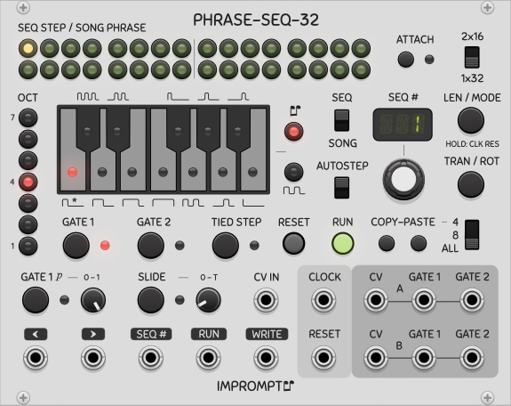

A 32 phrase sequencer module, where each phrase is an index into a set of 32 sequences of 32 steps (maximum). This sequencer is very similar to [PhraseSeq16](#phrase-seq-16), but with an added configuration switch allowing the sequencer to output dual 16 step sequences (**2x16**) instead of single 32 step sequences (**1x32**). When the 1x32 configuration is selected, only the top channel outputs are used (labeled A), and when the 2x16 configuration is selected, the top row is sent to the top outputs (CV and gates A), whereas the bottom row of steps is sent to the bottom outputs (CV and gates B). 

When running in the 2x16 configuration and in Seq mode, the following details become relevant:

1. When **ATTACH** is activated, clicking any step in a given row will attach the edit head to that row. 
1. Only the row corresponding to the edit head's position will be transposed or rotated when the **TRAN/ROT** button is used.
1. One extra run mode is also available for sequences, called **RN2**. This run mode allows the two sequences to play randomly but separately, as opposed to RND which plays them randomly but together.

Other than these characteristics, the rest of PhraseSeq32's functionality is identical to that of PhraseSeq16, including the use of the expander module.

([Back to module list](#modules))


<a id="prob-key"></a>
## ProbKey

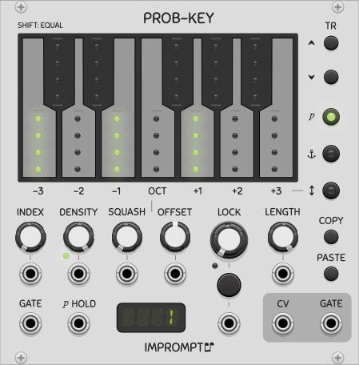

A keyboard-based random note generator with room to store 25 randomization presets, that can be recalled using a 0 to 2V control voltage (index). The module allows per-note probability, per-note root octave (anchor) and an octave range for randomly choosing the octaves of the generated notes. These three settings, accessible in the keyboard's keys, can be edited using the three LED-buttons on the right side. These three buttons are referred to as the edit mode buttons. In the first two modes (_p_ and anchor), the settings are per key note, whereas in octave range edit mode, only the white keys are used to select the probabilities for the -3 to +3 octave offsets. 

The first edit mode (_p_) controls note probabilities, which dictate how often each of the twelve base notes are to be generated. When the sum of probabilities is less than 1, some steps can be skipped, when the sum is greater than one, it is normalized. The second edit mode (octave anchor) sets the octave for each of the notes that has a non-zero probability. In the module's default state, C4, E4 and G4 are selected to randomly play, each with a 1/3 probability. The third edit mode (OCT) can be used to determine octave offsets that will be randomly chosen when a new note is to be generated. When turning up the -1 and +1 values to maximum (along with the central value also at maximum), for example, a given note will randomly have its octave shifted up by one, down by one, or kept intact, each with a 1/3 probability of occurring. 

When shift clicking the keys, all probabilities and anchors will be set to the same values in the first two modes, and in octave range edit mode, the ranges will be set symmetrically. The module does not have clock and reset inputs, it is up to the user to supply the intended tempo via the gate input; in this sense, ProbKey does not know about triplets and dotted notes etc., it simply generates a note on every gate it receives.

The module also has a 32-step buffer for locking interesting patterns in order to repeat them. The main thing to know about lock is that it has the highest priority, meaning that when a locked note is chosen, most of the settings relating to probabilities have no effect. When a random note is chosen, all currently selected randomization settings in the keys will be used to generate a new note. With the lock knob at 50% for example, there is a 50/50 chance that the next note will be a new random note, or the note at that point in the lock buffer (a reused note).

It's also important to keep routing delays in mind when patching. Cables and modules add signal delays and can impact the timing of pitch CVs vs gate signals. For example, sending the gate output directly to *VCV Host* but sending the CV output through *VCV Oct* before going to Host will make it such that the CV will change one sample after the gate event was registered, which can cause problems with some VSTs in Host. In such cases, simply sending the gate signal through VCV Mutes, VCV 8vert or any other similar module can be used to delay it also by the same number of samples, such that both Gate and CV arrive at their destination with the same routing delays.


* **INDEX**: This knob is used to select the given randomization settings from the set of 25 possible settings that can be stored in the module. Randomization settings are the values stored in the keys in all three edit modes (probabilities, octave anchors and octave ranges). The values of all knobs are global and are not indexed as part of the randomization settings. The CV input for the Index knob is a CV value that is added to the value of the Index knob. When using the CV input, the knob should ideally be in its left-most position. Each index can then be recalled using the V/Oct voltages corresponding to the interval of notes from C4 (= 0V = 1st setting) to C6 (= 2V = 25th setting). With this range, settings can be recalled using a single note output from another sequencer in order to play progressions. Another interesting use case is to set up the [CV-Pad](#cv-pad) module to recall the settings using single buttons (see its menu option called *Fill with notes C4-D5#* for automatically setting up these voltages in the CV-Pad). An option in the right-click menu called "Index mode 12" is also available, please see further below for more details.

* **LOCK, LENGTH**: The Lock knob determines whether the next note is a new note or a re-used note from the lock buffer. At 0%, every next note is a new note, at 100% every note is a note stored in the lock buffer, and any setting in between controls the probability of this choice. An interesting setting is 90 to 95%, whereby a pattern will be slowly morphed over time to create a repetitive but evolving melody. The lock buffer is simply a shift register of the last CV values that have been output. The length of this buffer can be selected using the Length knob (1 to 16 steps). A lock button is also located below the lock knob, in order to easily and manually inject a repetition (i.e. cause a momentary lock note-reuse) when the lock knob is below 50%, or inject a new random note when the lock knob is above 50%. This button has the effect of momentarily turning the knob fully in the opposite direction, depending on its current setting (below 50% or above 50%). The button can be referred to as the _lock-opposite_ button. 

* **GATE in**: A gate signal generates a new note event. A trigger can also be sent to this input. 

* **CV and GATE out**: These outputs at the right side of the module are the different notes that are generated. The gate output is such that when the sum of all note probabilities is less than 1, some notes can be randomly skipped. The gate output is a copy of the gate input when a note is active, and is 0V when a note is skipped.

* **DENSITY**: This determines the probability (expressed as a percentage) that a step will be played. The percentage is accurate provided the sum of all note probabilities is greater or equal to 1. When the sum is less than 1, then notes will randomly play less often than indicated by this knob. The density knob can be used to gradually decrease the amount of notes generated for performing a gradual lead-in or lead-out. The gain knob can be gradually decreased down to 0%, where no notes will be produced (provided lock is at 0%). The small LED near the Density knob will be red when the sum of all probabilities or the density knob are less than 1, which indicates that some notes will be skipped; green indicates that no notes will be skipped. 

* **SQUASH and OFFSET**: To better understand how these knobs work, it is recommended to select range edit mode and turn up all octave range values (-3 to +3) to their maximum values. Gradually turning the Squash knob clockwise gives the ability to reduce the spread of the octave ranges in a single control. As expected, the offset knob shifts the octave ranges left or right. Dual colors in the keys show the original shape (green) and the shifted/squashed shape (red), such that with no squash nor offset, the octave ranges are always shown in yellow.

* **COPY/PASTE**: Use this to copy the current randomization settings from one index position and paste them into another index position. This is done using the clipboard, such that copy/pasting to another instance of ProbKey is possible.

* **TR UP/DOWN**: Transpose the probability values of the currently selected randomization settings by one semitone. The octave anchors are automatically adjusted accordingly. These buttons have no effect on the octave ranges and are disabled when the octave range edit mode is selected.

* **_p_ HOLD**: When this CV input is high, any new random note that needs to be generated will be identical to that previously generated random note. This can be used to set up ratchetting with a multi-track gate sequencer, for example.

Other options are also available in the right-click menu:

* **Squash overlap**: This slider determines how much overlap is applied between octaves as the squash knob is turned up. With 100% overlap, all ranges except the center one are controlled in tandem, whereas at 0% overlap, the squash knob will gradually reduce each range consecutively.

* **Index mode 12**: This option will map the index knob and its CV input (V/Oct voltages) to indexes 1 to 12. This can be used to set up different probability settings for each type of note (C, D, E, etc.) coming from another sequencer or ProbKey module. When this option is active, negative values in the CV input are also taken into account to perform the mapping; for example, notes C3 (-1V), C4 (0V) and C5 (1V) will all map to index #1, whereas C3#, C4#, C5#, will all map to index #2, and so forth.

* **Show generated note**: When active, the top light in the key corresponding to the generated note will be lit white or red to show which note is currently playing (visible in the _p_ edit mode only). This visual feedback has a 3 second hold on each rising edge of the gate input and thus turns off automatically when gates are stopped. Top light will be red when the step is locked (because of the Lock knob or the Manual step lock menu), or white when a new note was generated.

* **Portable sequence**: The portable sequence standard can also be used to copy/paste the current lock buffer, for use in sequencers or other modules (and also within ProbKey itself). For this, use the menu item labeled "_Portable sequence_". When working with polyphony, only the lock buffer of the first channel is used. As an interesting use case, different random variations of sequences can be captured and entered into Foundry or one of the Phrase Sequencers in order to make a song.

* **Manual step lock**: This menu allows individual steps to be locked manually. The menu is not automatically closed when clicking steps or the *Clear all* option; to close the menu, the Done item can be clicked (which does nothing internally except close the menu), or by clicking elsewhere on the module. Manually locking steps is only advised when the Lock knob is at 100% (full right) or if Prob-Key is not receiving any gates; if not, the *Manual step lock* menu will quickly get out of sync with the notes stored in the lock buffer since the menu is not dynamically updated when held open.

The ProbKey module supports **polyphony** such that a polyphonic gate input will generate a polyphonic CV/gate output pair where each channel will generate separate random notes according to the (unique) settings of the module. The *Density*, *Squash* and *Offset* CV inputs also support polyphony in order to exert a certain amount of control over the different voices, but in order to have true separate randomness across multiple channels, separate ProbKey modules must be used and then merged.

([Back to module list](#modules))


<a id="sms-16"></a>
## SMS16


(*Concept and design by Xavier Belmont; sequencer by Impromptu*)

An all-in-one pre-patched semi-modular synthesizer. Based on the [VCV Fundamental](https://vcvrack.com/Fundamental.html) modules by VCV and the [PhraseSeq16](#phrase-seq-16) sequencer (above). Please see those links for the respective manuals, while keeping in mind that not all features of the Fundamental modules were implemented in SMS16 (Semi-Modular Synth 16). A typical signal flow is internally patched by default, as shown by the interconnecting lines on the faceplate of the module. The majority of the internal connections can be overridden by any cables patched into those related jacks. 

This module can be used for quickly exploring ideas for sequences, and is also useful for those new to modular synthesis before learning how to fill the screen with cables! Also note that the final output is the low-pass output of the VCF module (Voltage Controlled Filter). The VCF is purposely placed after the VCA (Voltage Controlled Amplifier) in the signal flow, such that the VCF can be lightly saturated, producing a thicker sound, especially when the Drive knob is turned up.

Extra controls were also added to the LFO (Low Frequency Oscillator), namely **GAIN** and **OFFSET**, to be able to easily modulate any other on-board parameter. With maximum gain, the LFO produces a 10V peak-to-peak signal (i.e. 5V amplitude). The offset knob is automatically scaled such that with maximum (minimum) offset, the signal's maximum (minimum) voltage is +10V (-10V). That is, with the gain set to 0, the offset value spans -10V to +10V, and with the gain set to maximum, the offset value spans -5V to +5V. Also note that the clock LFO is automatically reset on every reset event in the sequencer.

The SMS16 also features the advanced gate mode of the PhraseSeq16. When changing the clock resolution in the SMS16, the onboard clock will automatically be scaled accordingly and no multiplied clock needs to be supplied to the module.

([Back to module list](#modules))


<a id="tact"></a>
## Tact/Tact1/TactG

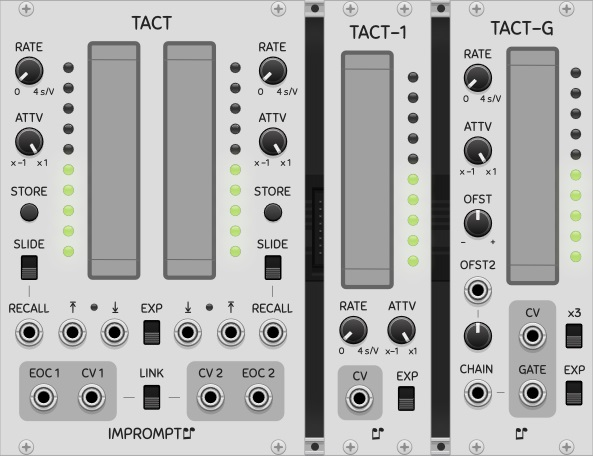

Touch-like controller modules CV outputs and variable rate of change. With a fast rate of change, the controllers offer an alternative to knobs for setting parameters, and with a slow rate of change they can be used to automate in-out fades, for example, freeing the performer to work elsewhere in the patch. Tact-1 is a single channel version of Tact with fewer options, while Tact-G is a Tact-1 with one gate output and two offset controls. 

* **RATE**: Transition time of CV, from 0 (instant transition) to 4 seconds per volt. Transition time is the inverse of slew rate. This knob can be turned in real time to affect the rate of change of a transition already under way. An option in the right-click menu called **Rate knob x3** can be used for even slower transitions, in which case a full transition from 0 to 10V (or vice versa) will last 2 minutes instead of 40 seconds in the default setting.

* **ATTV**: Typical attenuverter to set the maximum CV range output by the module. At full right, a 0 to 10V CV is produced, and at full left, a 0 to -10V CV is produced.

* **LINK**: Both controls are linked and will be synchronized to the same value. Useful when controlling stereo sounds. Only the left side controls have an effect in this mode; however, both touch pads can be used to change the single CV (which is sent to both output jacks).

* **STORE**: memorize the current CV to later be recalled when a trigger is sent to the Recall CV input.

* **RECALL and ARROW Inputs**: CV inputs for setting the CVs to their stored/top/bottom position. These are edge sensitive inputs with a 1V threshold.

* **SLIDE**: determines whether the recall operation is instantaneous or transitions according to the current rate knob's setting.

* **EXP**: Produces an exponential slide (top position) instead of a linear slide (bottom position).

* **EOC**:  EOC is an end-of-cycle trigger that is emitted when a slide is completed (to signal its end); this can be used for more automation, for example, by triggering or chaining other operations when a fade in/out completes. The EOC triggers upon the end of any slide event, whether the end position is at the top/bottom or not.

A 0V CV is initially stored in the CV memory and the slide switches are in the off position, thereby allowing the Recall to act as a **Reset** by default. An option in the right-click menu, called **Level sensitive arrow CV inputs** can be activated to control the duration of the transition. When this option is turned on, the input must be continuously held above 1V for the transition to progress, and when the input goes back under 1V, the transition will stop at its current level.

The **Auto-return** option in the modules' right menus can be used to momentarily affect the tact pads with the mouse, and have the level return to a prescribed value upon releasing the mouse button. When this option is activated, the Arrow inputs implicitly become level sensitive and can also be used to momentarily effect the level.

The x3 switch on Tact-G, or alternatively the x3 menu options in Tact and Tact-1, can be used to tripple the rate knob's value for even slower transitions (rate knob is 0 to 12 s/V when active).

In Tact-G, two offset controls are added, one is a knob for direct control while the other is a CV input with attenuverter. Both options can be used simultaneously, for adding a random source in offset 2 for example, while still allowing a manual offset using the first offset. The gate outputs can be chained when using multiple Tact-G modules using the chain input.

([Back to module list](#modules))


<a id="twelve-key"></a>
## TwelveKey

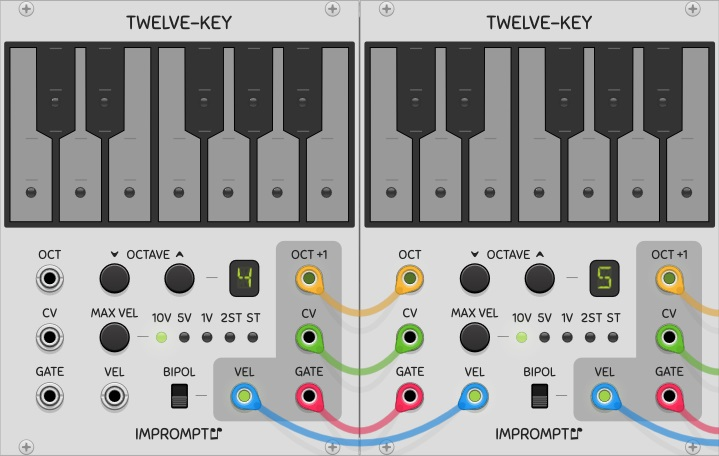

A chainable keyboard controller for your virtual Rack. When multiple TwelveKey modules are connected in series from left to right, only the octave of the left-most module needs to be set, all other down-chain modules' octaves are set automatically. The aggregate output is that of the right-most module. To set up a chain of TwelveKey modules, simply connect the four outputs on the right side of a module to the four inputs of the next module beside it (typically to the right). With creative patching, the velocity output can be used to modulate a filter, to perform pitch bends, etc. The velocity is controlled by pressing the keys at different vertical positions within the guide marks on the keys.

* **CV**: The CV output from the keyboard or its CV input, depending on which key was last pressed, i.e. an up-chain key (from a module to the left) or a key of the given keyboard module.

* **GATE**: Gate output signal from the keyboard or its gate input.

* **OCTAVE -/+**: Buttons to set the base octave of the module. These buttons have no effect when a cable is connected to the OCT input.

* **OCT**: CV input to set the base octave of the module. The voltage range is 0V (octave 0) to 9V (octave 9). Non-integer voltages or voltages outside this range are floored/clamped. 

* **OCT+1**: CV output for setting the voltage of the next down-chain TwelveKey module. This corresponds to the base octave of the current module incremented by 1V.

* **VEL**: The velocity output from the keyboard or its velocity input, depending on which key was last pressed, i.e. an up-chain key (from a module to the left) or a key of the given keyboard module. The velocity is a voltage corresponding to the vertical position of the mouse click on the key. The voltage range is determined by the BIPOL and MAX VEL settings.

* **MAX VEL**: Maximum voltage of the velocity output. "ST" is shorthand for semitone. 

* **BIPOL**: allows the selection of unipolar velocity (bottom position), or bipolar velocity (top position). For example, with a maximum velocity voltage of 10V, the velocity range of a key is 0 to 10V in unipolar mode, or -10V to 10V in bipolar mode.

Options available in the right-click menu include:

* **Inverted velocity range**: When this option is active, the maximum velocity will be at the top-most part of the keys, instead of at the default bottom-most part of the keys.

* **Link velocity settings from left**: When linking multiple TwelveKey, this option can be activated to propagate the velocity settings (Max Vel, Bipol and Velocity Inversion) from the first module in the chain down to all the other ones placed to the right; no spaces between modules are allowed in this case.

* **Tracer**: Keep the last key pressed faintly lit. Because multiple TwelveKey modules do not communicate bi-directionally when making a mutli-octave keyboard, it is not possible to have a single bright light showing the last unique key pressed across all modules.

* **CV input viewer**: When this option is activated, the module will not respond to key presses but will instead show which  key the CV input corresponds to, provided that the given CV is within in the selected octave. In this manner, a chain of TwelveKey modules, each having the option activated, will serve as a keyboard note indicator. When a note is outside of the octave intervals of the chain, no key will light up. When using this setup, the Octave, CV and Gate connections should be made between all TwelveKey modules. The CV is simply a pass through, the Octave automatically sets up consecutive octaves as usual, and the gate is used as an enable for the key light. When the left-most module's Gate input is unconnected, a selected key's light will stay continually on.


([Back to module list](#modules))


<a id="write-seq"></a>
## WriteSeq32/64

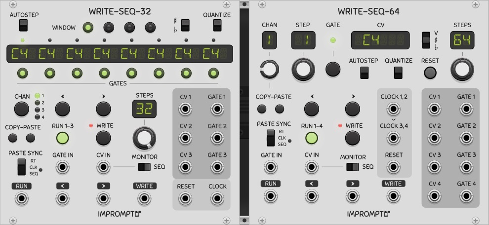

WriteSeq32 is a three-channel 32-step writable sequencer module. Although the display shows note names (ex. C4#, D5, etc.), any voltage within the -10V to 10V range can be stored/played in the sequencer, whether it is used as a pitch CV or not, and whether it is quantized or not. Gate states and window selection can be done by pressing the 8 and 4 LED buttons respectively located below and above the main display. Familiarity with the VCV SEQ-3 sequencer is recommended, as some operating principles are similar in both sequencers. It is also strongly recommended to read the section [general concepts](#general-concepts) for more relevant information that is not repeated here. 

* **WINDOW**: LED buttons to display/select the active 8-step window within the 32 step sequence (hence four windows). No effect on channels 1 to 3 when the sequencer is running.

* **QUANTIZE**: Quantizes the CV IN input to a regular 12 semitone equal temperament scale. Since this quantizes the CV IN, some channels can have quantized CVs while others do not. 

* **Main display**: Shows the note names for the 8 steps corresponding to the active window. When a stored pitch CV has not been quantized, the display shows the closest such note name. For example, 0.03 Volts is shown as C4, whereas 0.05 Volts is shown as C4 sharp or D4 flat. Octaves above 9 or below 0 are shown with a top bar and an underscore respectively.

* **GATES**: LED buttons to show/modify the gates for the 8 steps in the current window. Gates can be toggled whether the sequencer is running or not. Two gate modes are available: standard gates (that use the clock pulse) and full gates (that hold the note across the whole step and ties it to the next one). Clicking a gate alternates between the following three states: normal, held (full), off.

* **CHAN**: Selects the channel that is to be displayed/edited in the top part of the module. Even though this is a three-channel sequencer, a fourth channel is available for staging a sequence while the sequencer is running (or not).

* **COPY-PASTE**: Copy and paste the CVs and gates of a channel into another channel. All 32 steps are copied irrespective of the Steps knob setting.

* **PASTE SYNC**: Determines whether to paste in real time (RT), on the next clock (CLK), or at the start of the next sequence (SEQ). Pending pastes are shown by a red LED beside CLK/SEQ, and if the selected channel changes, the paste operation will be performed in the channel that was selected when the paste button was pressed. Paste operations into the staging area (channel 4) are always done in real time, irrespective of the state of the paste sync switch. To cancel a pending paste, press the Copy button again.

* **<, >**: These buttons step the sequencer one step left or right. No effect on channels 1 to 3 when the sequencer is running. A rising edge on the \"<\" or \">\" control voltage inputs triggered at 1V will also step the sequencer left/right by one step.

* **RUN 1-3**: Start/stop the sequencer. When running, the sequencer responds to rising edges of the clock input and will step all channels except the staging area (channel 4). A rising edge on the RUN input will also toggle the run mode.

* **WRITE / CV IN**: please see [General Concepts](#general-concepts) above for information on how to write notes into the sequencer.

* **GATE IN**: Can be used to also set/clear the gate of the current step/channel during a Write. If no wire is connected, the input is ignored and the currently stored gate is unaffected. No effect on channels 1 to 3 when the sequencer is running.

* **STEPS**: Sets the number of steps for all the sequences (sequence length).

* **MONITOR**: This switch determines which CV will be routed to the currently selected channel's CV output when the sequencer is not running. When the switch is in the right-most position, the CV stored in the sequencer at that step is output; in the left-most position, the CV applied to the CV IN jack is output.

WriteSeq64 is a four-channel 64-step writable sequencer module. This sequencer is more versatile than WriteSeq32 since each channel has its own step position and maximum number of steps (length). Sequences of different lengths can be created, with different starting points. A fifth channel is available to be used as a staging area. 

WriteSeq64 has dual clock inputs, where each controls a pair of channels. When no wire is connected to **CLOCK 3,4**, the **CLOCK 1,2** signal is used internally as the clock for channels 3 and 4. 

([Back to module list](#modules))


<a id="utilities"></a>
## Utilities


<a id="part"></a>
### Part

A gate splitter module based on a CV input and a split point. One use for this module is to split a polyphonic gate signal from a keyboard into two different polyphonic gate signals, such that the left and right hand parts can be sent to different voices. In such a case, the polyphonic CV should also be sent directly to each voice, and only the gates below/above the split point will produce sound in their respective voices. The module can also be used with monophonic signals. When chaining two Part modules to select a range of notes (with an upper and lower bound), it is important that the CV input of the second Part module be connected to the THRU output of the first Part module, to ensure gates and CVs have identical propagation delays. This is necessary to avoid glitches that can occur when gates are held continually high and the CV changes from a value above the upper bound to below the lower bound in two succesive Rack samples (or vice-versa). An option called **Apply -1mV epsilon to split point**, which is on by default, subtracts 1mV to the split point in order to produce consistent splitting given the small imprecisions often found in the CV input's V/Oct levels; this option can be deactivated in the module's right click menu.

<a id="four-view"></a>
### FourView
A chord viewer module that shows the note names of up to 4 CVs, or the name of the chord represented by these CVs. Sharp or flat notation is selectable in the right-click menu. Bottom jacks are through outputs. FourView can also function as an expander for ChordKey or CVPad by placing it to the right of either of those two modules; in this case: a) no cables need to be connected in order to view the note names of the chord notes or pad voltages and b) the through outputs are not used. The FourView module also allows the copying of the displayed notes via the Portable sequence format for pasting as a chord in ChordKey or other modules. For more information, please see the [ChordKey](#chord-key) manual, as the two available copy options are the same as in that module.

<a id="hotkey"></a>
### Hotkey
Sends a trigger when a given keyboard key is pressed. The mouse cursor must be over the module. This module was made to synchronize audio recording using VCV Recorder with video recording (using OBS Studio for example). Set a hotkey in OBS to automatically have it start/stop recording upon a given keypress (works even when OBS is not in focus), then maximize Rack and set the same key in Hotkey; both recorders can then be started and stopped simultaneously on the same key-press. Send the trig output of Hotkey into the trig input of VCV Recorder.

* **SET**: The hotkey can be programmed using the SET button. When armed, any key press will be captured and used as the hotkey. For key combinations, like ALT+K for example, all modifiers (ALT, CTRL/CMD, SHIFT) must be pressed before arming the SET button. Once armed the next key is automatically taken, along with any modifyers that are pressed. This allows the CTRL key itself to be used as a hotkey (when pressed after arming).

* **DELAY**: Delay the trigger output by an amount of time between 0 and 1 second. To enter an amout of time more precisely, use Rack's parameter right-click to enter a value directly. 

The current hotkey is visible in the right-click menu of the module and is automatically saved. 

([Back to module list](#modules))


<a id="hall-of-fame"></a>
# Hall of Fame

Here are a few videos featuring Impromptu Modular, which I find particularly very inspiring and interesting (listed in no particular order). Many talented Rackheads have made tracks using Impromptu modules, and this list could in fact be quite long. I have no formal criteria for why a track ends up in the list or doesn't. 

* **Nigel Sixsmith**, [Talking Rackheads episode 8, PS16 MegaPatch Play Out](https://www.youtube.com/watch?v=KOpo2oUPTjg&t=5504s)

* **Omri Cohen**, [Arvo Part - Spiegel im Spiegel VCV Rack Cover](https://www.youtube.com/watch?v=6bm4LjRYDmI)

* **Omri Cohen**, [Neutron & VCV Rack - Clapping Music](https://www.youtube.com/watch?v=VMbZfQDpgcA)

* **Isaac Hu**, [In the Hall of the Mountain King](https://www.youtube.com/watch?v=fxYc0H5i6HA)

* **John Melcher**, [Steppes](https://www.youtube.com/watch?v=ruo4s_Hyhrw)

* **Lars Bjerregaard**, [Intertwined](https://www.youtube.com/watch?v=Xt9zOsVQUHc)


